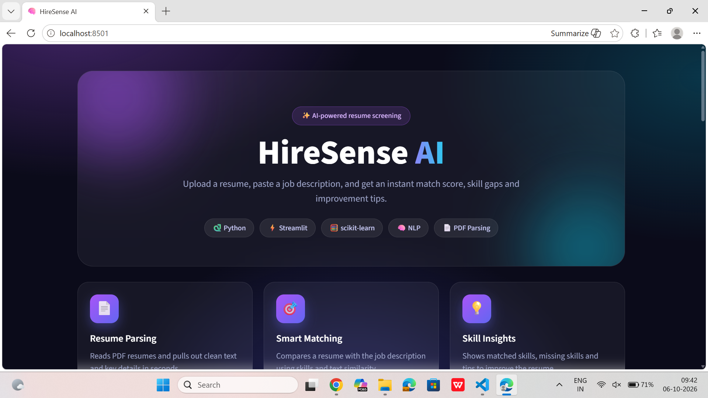
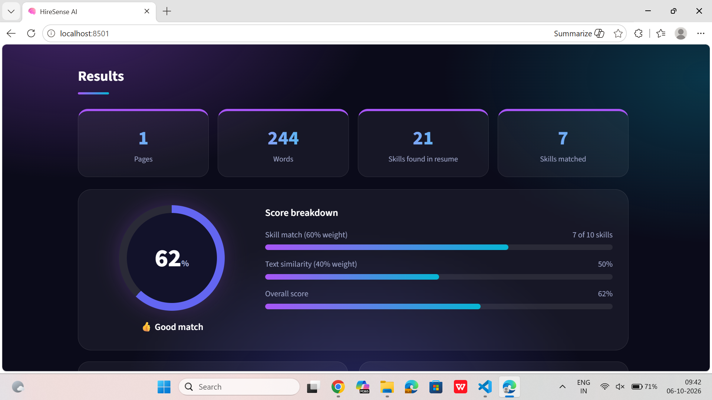
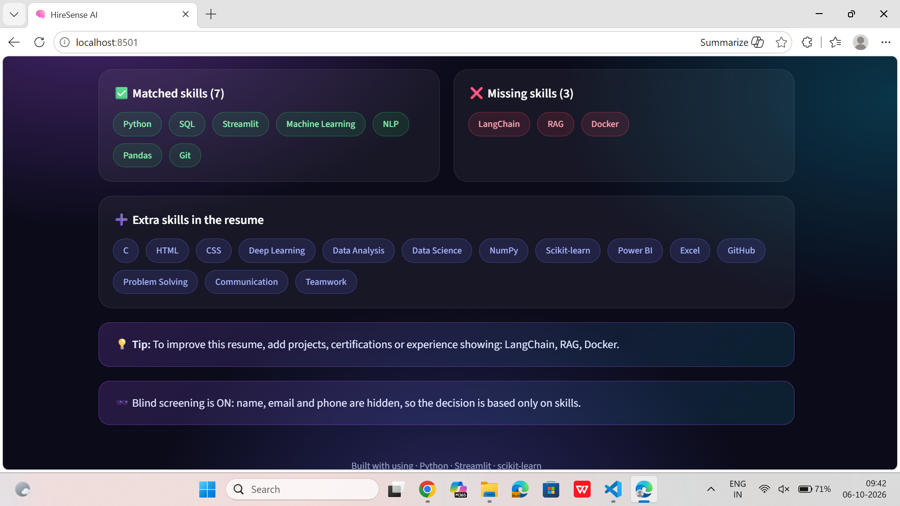
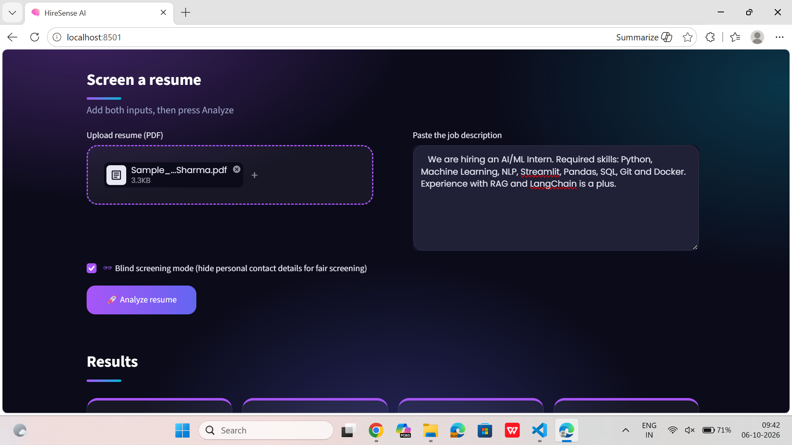
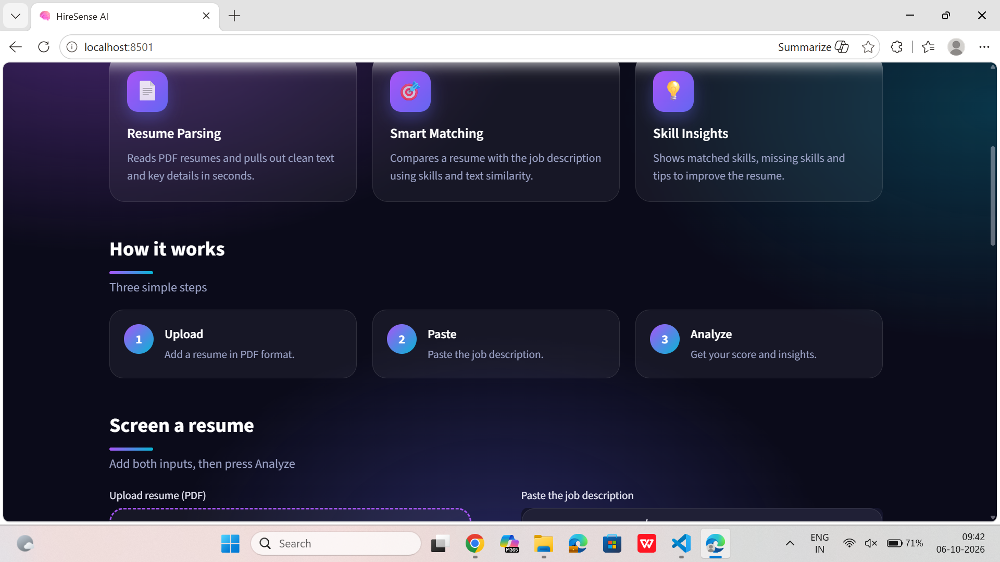

# HireSense AI

An AI-powered resume screening assistant built with Python and Streamlit. Upload multiple resumes, paste a job description, and get a ranked shortlist with explainable scores, skill gaps and AI feedback.

## Why this project?
Recruiters receive hundreds of resumes for a single role, and reading each one takes a lot of time. HireSense AI does the first round of screening in seconds, so recruiters can focus on the best candidates. Students can also use it to see which skills they are missing for a role and improve their resumes before applying.

## Features
- Upload multiple resumes at once (PDF or Word)
- Match score = 60% skill match + 40% text similarity (TF-IDF and cosine similarity)
- Ranked leaderboard with medals and a bar chart
- Download the ranking as an Excel file
- Matched, missing and extra skills for every candidate
- Blind screening mode that hides names for fairer screening
- AI feedback and interview questions using Gemini (optional)
- Custom dark UI built with HTML and CSS

## Screenshots

### Home


### Ranking


### Ranking with more candidates


### Candidate details


### App in action


## How it works
1. **Parsing:** `pypdf` and `python-docx` extract the text from each resume.
2. **Skill extraction:** the app finds known skills in the resume and in the job description.
3. **Scoring:** the final score combines the skill match (60%) and the text similarity (40%), calculated with TF-IDF and cosine similarity from scikit-learn.
4. **Output:** a leaderboard, a score breakdown, matched and missing skills, and an Excel export.
5. **AI feedback (optional):** Gemini writes improvement tips and interview questions. Emails and phone numbers are removed before any text is sent.

## Tech Stack
Python 3.11, Streamlit, scikit-learn, pandas, pypdf, python-docx, HTML and CSS, Gemini API

## Project Structure
```
HireSense_AI/
├── app.py              # main Streamlit app
├── assets/
│   └── style.css       # custom styling
├── .streamlit/
│   └── config.toml     # theme settings
├── screenshots/        # images used in this README
├── requirements.txt    # packages
├── .gitignore
└── README.md
```

## Setup
1. Clone the repository: `git clone https://github.com/Akshayajakkula/HireSense-AI.git`
2. Go into the folder: `cd HireSense-AI`
3. Create a virtual environment: `python -m venv venv`
4. Activate it (Windows): `venv\Scripts\activate`
5. Install packages: `pip install -r requirements.txt`
6. (Optional) Create a `.env` file with: `GEMINI_API_KEY=your_key_here`
7. Run the app: `streamlit run app.py`

The app works without a Gemini key. Only the AI feedback tab needs one.

## Usage
1. Upload one or more resumes (PDF or Word).
2. Paste a job description.
3. Click **Analyze resumes**.
4. Check the **Ranking**, **Candidate details** and **AI feedback** tabs.

## Fairness note
HireSense AI is a decision-support tool. It does not reject candidates automatically, and a human should always make the final decision. Blind screening mode hides names so the first look is based on skills only.

## Future Improvements
- OCR for scanned resumes using Tesseract
- Skill extraction with spaCy
- Semantic matching with sentence-transformers
- Deployment on Streamlit Community Cloud

## Note
All sample data in this repository is fictional.

## Author
Jakkula Akshaya - B.Tech CSE (AIML)